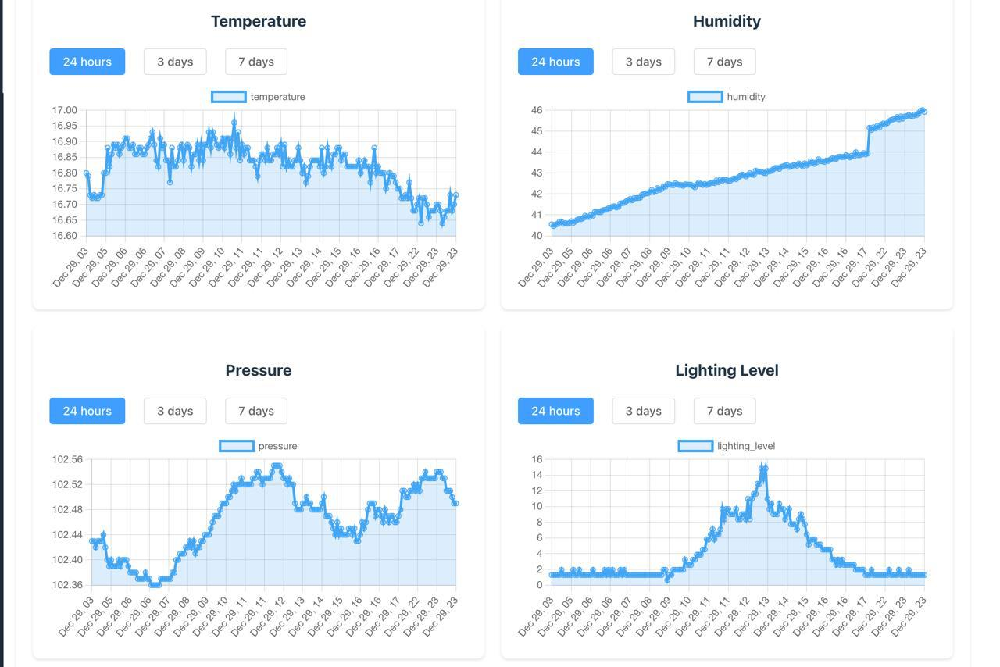

# Weather Monitoring Dashboard 🌤️

This project is a full-stack web application developed as a university project to visualize and monitor real-time weather data from multiple IoT sensors deployed across various locations in the Netherlands.

## 🌍 Overview of Sensor Locations

This dashboard provides a real-time view of four key sensor locations:
- Enschede (our sensor)
- Enschede (university sensor)
- Gronau
- Wierden

Each location collects data on temperature, humidity, pressure, lighting level, and signal strength.


---

## 📊 Real-Time Charts

The application displays dynamic charts for:
- Temperature 🌡️
- Humidity 💧
- Pressure ⬇️
- Lighting Level 💡

Data can be visualized over time frames of 24 hours, 3 days, or 7 days.



---

## 🔍 Weather Details View

For each location, users can explore detailed weather metrics including:
- Current temperature
- Humidity
- Lighting level
- Battery status
- Connection strength (RSSI)
- Dynamic weather icon based on conditions


---

## 🔗 API Endpoints (GET)

Use these endpoints to query weather data via tools like Postman:

- **Latest weather per location:**
  ```
  http://localhost:3000/weather?location=Enschede
  http://localhost:3000/weather?location=Wierden
  http://localhost:3000/weather?location=Gronau
  http://localhost:3000/weather?location=Enschede (our sensor) → http://localhost:3000/weather?location=Lora
  ```

- **Historical chart data:**
  ```
  http://localhost:3000/weather/Enschede?parameter=temperature&timeRange=1day
  http://localhost:3000/weather/Wierden?parameter=humidity&timeRange=7days
  ```

---

## 🚀 How to Run Locally

Make sure you have Node.js and npm installed. Then run:

```bash
# Clone the repository
git clone https://github.com/yourusername/vue-sql-weather-monitor.git
cd vue-sql-weather-monitor.git

# Set permissions if needed
sudo chown -R $(whoami) node_modules
sudo chown -R $(whoami) .

# Install dependencies
sudo npm install

# Start backend
cd src
node server.js

# Start frontend (in another terminal tab)
cd frontend
sudo npm install
npm run dev
```

---

## 📦 Technologies Used

- **Vue 3** with Vite
- **Node.js** (Express)
- **Microsoft SQL Server** for data
- **Chart.js** for graphs
- **Element Plus** for UI components

---

## 💡 About the Project

This weather app was created as a team assignment at university to integrate real sensor data into an interactive web dashboard. One of the sensors is our own deployed LoRa device.

The project supports dynamic data visualization, animated weather icons, and real-time statistics.

---